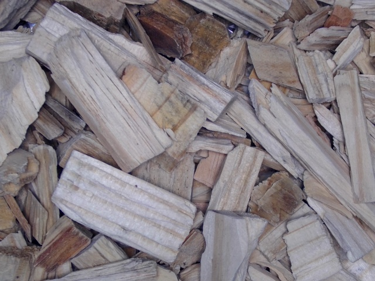
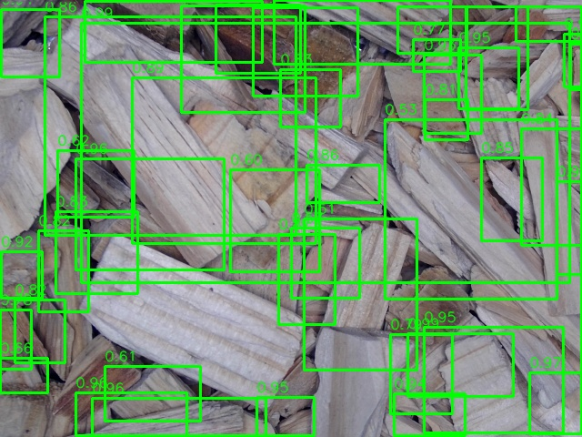
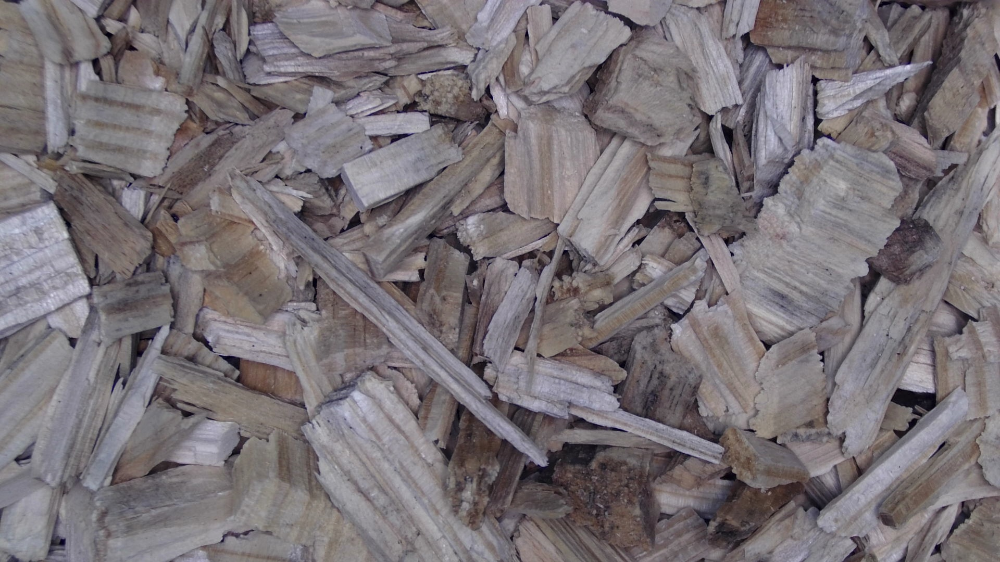
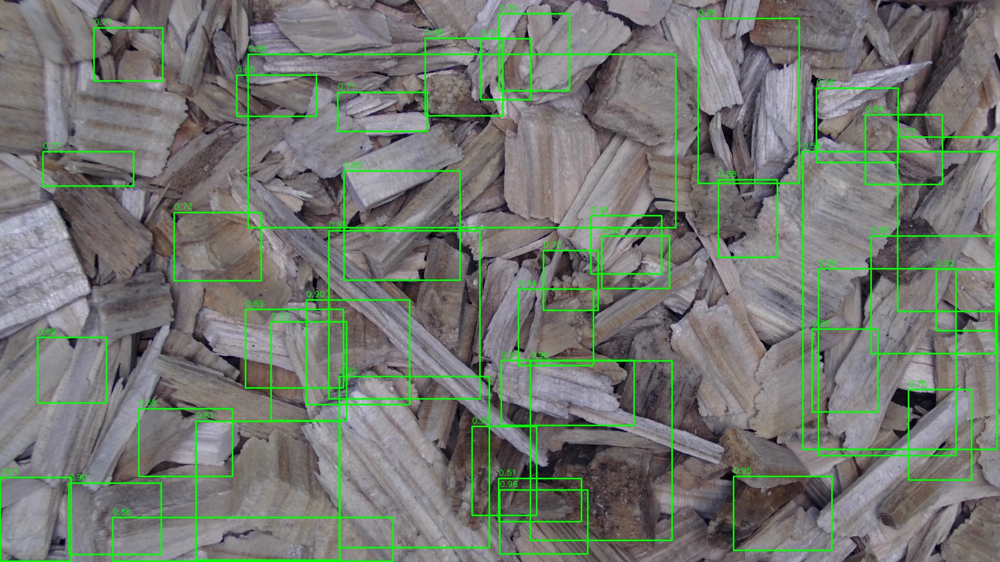
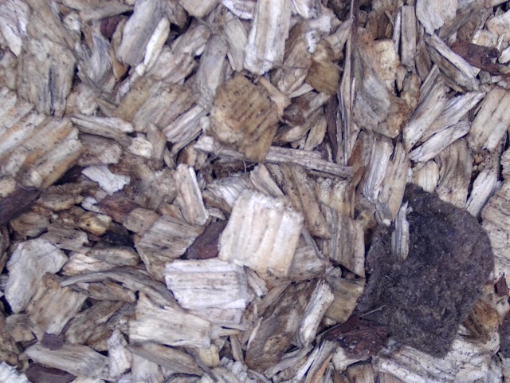
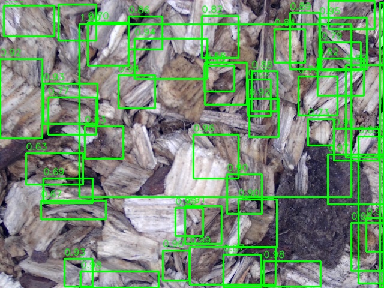
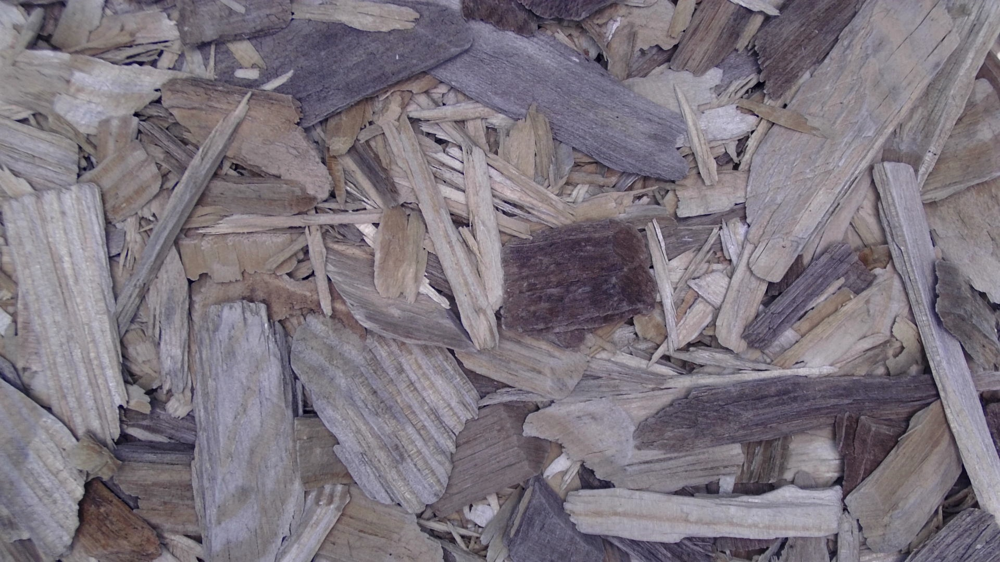
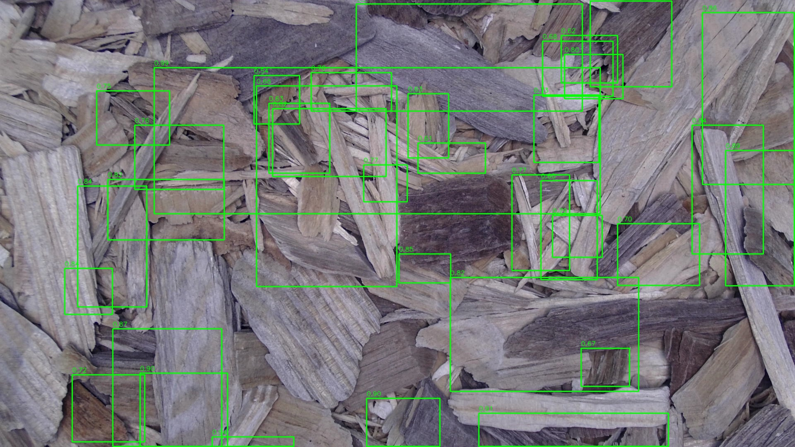

# Wood-Chip Monitor

**An Edge-AI System for Real-Time Wood Chip Quality Evaluation**

Wood-Chip Monitor is a portable edge-AI system for real-time wood-chip quality assessment on NVIDIA Jetson hardware. The system integrates visual chip detection, physical size estimation, size-distribution monitoring, oversize alerts, and vision-based moisture assessment in a fully local deployment.

> **Status:** This repository is being prepared as the public research-software release of the Wood-Chip Monitor system.

<p align="center">
  
</p>

## Overview

Conventional wood-chip quality assessment often relies on periodic manual sampling and offline measurements. Wood-Chip Monitor was developed to move quality assessment closer to the production environment by combining computer vision, edge computing, and operator-facing decision support in a portable system.

The platform provides:

- real-time wood-chip detection,
- physical chip-size estimation,
- live size-distribution monitoring,
- oversize-chip identification and alerts,
- vision-based moisture assessment,
- local edge inference without cloud dependence,
- configurable quality-control parameters,
- and a browser-based monitoring dashboard.

## System Capabilities

### Visual Size Assessment

Detected wood chips are localized in the camera stream and converted from image-space measurements to physical dimensions using scene calibration. The resulting measurements are used to continuously characterize the observed chip-size distribution.

### Oversize Monitoring

The system evaluates detected chips against configurable quality thresholds and visually identifies oversize material during operation.

### Moisture Assessment

A lightweight vision model is integrated into the edge pipeline to provide image-based moisture assessment alongside chip-size measurements.

### Local Decision Support

Inference and monitoring are performed locally on NVIDIA Jetson hardware. The accompanying dashboard provides live visualization, system status, quality information, events, and configurable monitoring rules.

## System Dashboard

The browser-based dashboard provides an operator-facing interface for monitoring the Wood-Chip Monitor system.

The interface supports:

- live visual monitoring,
- detected-chip visualization,
- physical size measurements,
- size-distribution statistics,
- oversize alerts,
- moisture information,
- configurable quality rules,
- event monitoring,
- device status,
- and system administration functions.

<p align="center">
  
</p>

## Hardware Prototype

<p align="center">
  
</p>

The portable prototype integrates the edge-computing platform, imaging hardware, display, and custom enclosure required for on-site wood-chip quality monitoring.

The system was designed to perform inference and quality assessment locally, reducing dependence on cloud connectivity and enabling deployment close to the production environment.

## Example Detection Results

Representative inputs and corresponding detector outputs are included in [`examples/`](examples/).

| Input | Prediction |
|---|---|
|  |  |
|  |  |
|  |  |
|  |  |

These examples illustrate the dense wood-chip detection stage used by the downstream physical sizing and quality-analysis pipeline.

## Quality Analytics

The deployed inference pipeline continuously aggregates measurements from detected wood chips to characterize the observed chip population.

### Size Distribution

<p align="center">
  
</p>

The system maintains distribution-level information that can be used to monitor the composition of the observed wood-chip stream.

### Size Statistics

<p align="center">
  
</p>

These analytics complement individual-object detections by providing population-level information useful for quality monitoring.

## System Architecture

Wood-Chip Monitor integrates four primary layers:

1. **Image acquisition** from the monitoring camera.
2. **Edge-AI inference** for wood-chip detection and moisture assessment.
3. **Quality analytics** for physical sizing, distribution monitoring, and oversize detection.
4. **Operator decision support** through the monitoring backend and browser dashboard.

Conceptually, the deployed workflow is:

```text
RGB Camera
    │
    ▼
Edge-AI Runtime
    │
    ├── Wood-Chip Detector
    │       │
    │       ▼
    │   Chip Localization
    │       │
    │       ▼
    │   Physical Size Estimation
    │       │
    │       ├── Size Statistics
    │       ├── Size Distribution
    │       └── Oversize Monitoring
    │
    └── Moisture Model
            │
            ▼
      Moisture Assessment
            │
            ▼
      Monitoring Backend
            │
            ▼
      Browser Dashboard
```

Detailed software-architecture documentation will be added under [`docs/`](docs/).

## Software

The repository contains the core components of the deployed monitoring system.

### Edge-AI Runtime

[`app/live_cam_trt.py`](app/live_cam_trt.py) contains the Jetson/TensorRT live-camera inference pipeline.

Its responsibilities include:

- camera acquisition,
- TensorRT detector execution,
- chip detection processing,
- physical size estimation,
- size-statistics generation,
- oversize monitoring,
- moisture-model inference,
- and preparation of live monitoring information.

### Monitoring Backend

[`app/backend_app.py`](app/backend_app.py) provides the FastAPI-based monitoring backend.

The backend supports functionality including:

- application APIs,
- live telemetry,
- authentication,
- user roles,
- monitoring events,
- audit information,
- quality-rule configuration,
- device information,
- and communication with the operator dashboard.

### Browser Dashboard

The operator-facing interface is maintained in:

[`app/web/index.html`](app/web/index.html)

The dashboard communicates with the monitoring backend and presents the real-time system state to the operator.

## Configuration

Machine-specific runtime paths are not hard-coded into the public repository.

An example deployment configuration is provided at:

[`configs/device.env.example`](configs/device.env.example)

The runtime supports environment-based configuration for:

- camera device,
- camera resolution,
- camera frame rate,
- TensorRT model locations,
- moisture-model artifacts,
- output storage,
- database location,
- and device identity.

Local credentials and machine-specific configuration should never be committed to Git.

## Model Artifacts

Wood-Chip Monitor uses TensorRT-optimized models for edge inference.

Expected model artifacts include:

```text
models/
├── detr_resnet101_fp16.engine
├── moistnetlite_fp16.engine
└── moistnetlite_classes.txt
```

These binaries are intentionally excluded from version control because TensorRT engines depend on the target hardware and software stack.

See [`models/README.md`](models/README.md) for details.

## Edge Deployment

The reference prototype was deployed on an NVIDIA Jetson Nano using TensorRT-accelerated inference.

The validated deployment environment included:

- NVIDIA Jetson Nano,
- NVIDIA Tegra X1,
- approximately 4 GB system memory,
- Ubuntu 18.04.5 LTS,
- Python 3.6.9,
- and NVIDIA L4T R32.6.1.

Deployment information is documented in:

- [`docs/jetson-setup.md`](docs/jetson-setup.md)
- [`models/README.md`](models/README.md)
- [`configs/device.env.example`](configs/device.env.example)

A standalone TensorRT inference utility is provided in:

[`tools/infer_trt.py`](tools/infer_trt.py)

Additional model-export and engine-generation documentation will be added as the release workflow is completed.

## Deployment Tools

The [`tools/`](tools/) directory contains utilities supporting deployment and validation.

Currently included:

### TensorRT Image Inference

```text
tools/infer_trt.py
```

This utility executes the deployed DETR TensorRT engine against a directory of images and writes annotated predictions.

Example:

```bash
python tools/infer_trt.py \
    --engine models/detr_resnet101_fp16.engine \
    --images examples/images \
    --output outputs/predictions
```

See [`tools/README.md`](tools/README.md) for detailed usage.

## Validation

The system-development process included staged validation from reference workstation inference through Jetson deployment.

The development workflow included:

1. reference detector inference,
2. preprocessing and postprocessing verification,
3. workstation-to-edge output comparison,
4. TensorRT execution on Jetson,
5. physical size-analysis integration,
6. statistical-output verification,
7. and complete system-level inference.

The public repository will retain representative validation results and reproducibility documentation without committing the large intermediate tensors and duplicated development artifacts used during implementation.

## Related Research

Wood-Chip Monitor is part of a broader research effort in vision-based wood-chip quality assessment.

### UOT-DETR

UOT-DETR investigates distribution-aware object detection for wood-chip size-distribution estimation and manufacturing quality measurement.

Repository:

https://github.com/amirhossein-eskorouchi/UOT-DETR

### MoistNet / MoistNetLite

The moisture-assessment component builds on vision-based modeling developed for wood-chip moisture evaluation.

Publication and implementation links will be added before public release.

### Wood-Chip Detection Dataset

Annotated wood-chip imagery was used to support detector development and evaluation.

The dataset and associated publication will be linked before public release.

## Repository Structure

```text
Wood-Chip-Monitor/
├── app/
│   ├── __init__.py
│   ├── backend_app.py          # FastAPI monitoring backend
│   ├── live_cam_trt.py         # Jetson/TensorRT inference pipeline
│   └── web/
│       └── index.html          # Operator dashboard
│
├── assets/
│   ├── dashboard.png           # Dashboard overview
│   ├── prototype.png           # Physical prototype
│   ├── size_boxplot.png        # Example size statistics
│   └── size_distribution.png   # Example size distribution
│
├── configs/
│   └── device.env.example      # Example deployment configuration
│
├── docs/
│   └── jetson-setup.md         # Reference Jetson environment
│
├── examples/
│   ├── images/                 # Example wood-chip images
│   └── predictions/            # Example detector outputs
│
├── models/
│   └── README.md               # Model artifact requirements
│
├── tools/
│   ├── infer_trt.py            # Standalone TensorRT inference
│   └── README.md               # Deployment-tool documentation
│
├── .gitignore
└── README.md
```

Additional deployment, validation, and model-conversion utilities will be added as the corresponding components are prepared and documented for public release.

## Reproducibility

The public release is being organized to separate:

- source code,
- deployment configuration,
- model artifacts,
- runtime-generated data,
- validation evidence,
- and documentation.

Large machine-specific artifacts such as TensorRT engines, ONNX exports, intermediate NumPy arrays, runtime databases, and generated monitoring outputs are intentionally excluded from Git version control.

## Related Links

Project links will be completed before public release.

- **UOT-DETR:** https://github.com/amirhossein-eskorouchi/UOT-DETR
- **Paper:** Coming soon
- **Dataset:** Coming soon
- **Demo:** Coming soon
- **Moisture model:** Coming soon

## Citation

Citation metadata will be added before public release.

## License

License information will be added before public release.