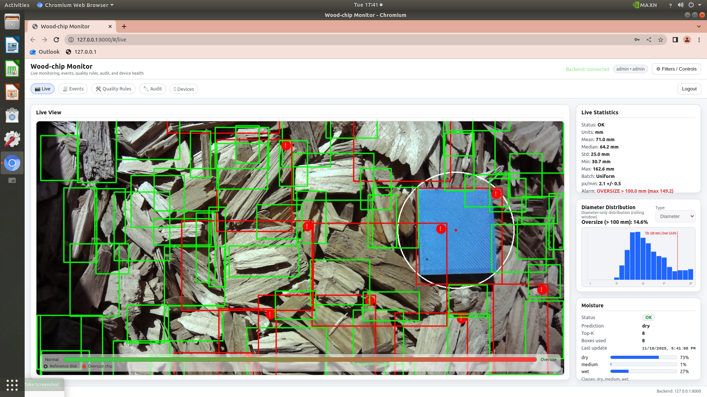
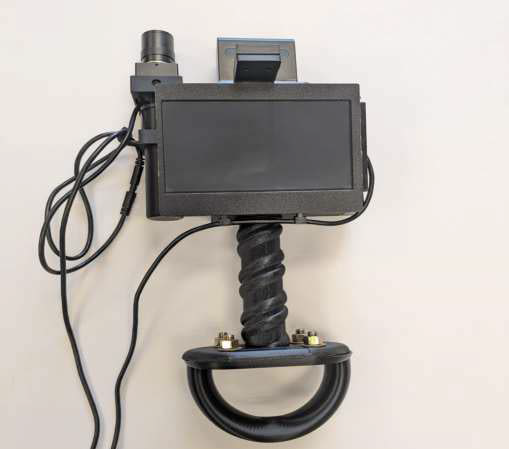
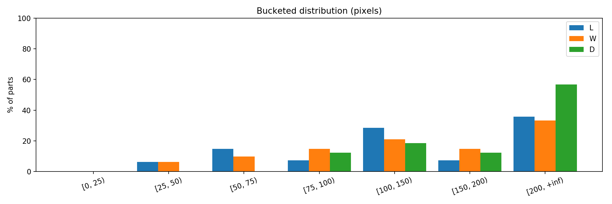
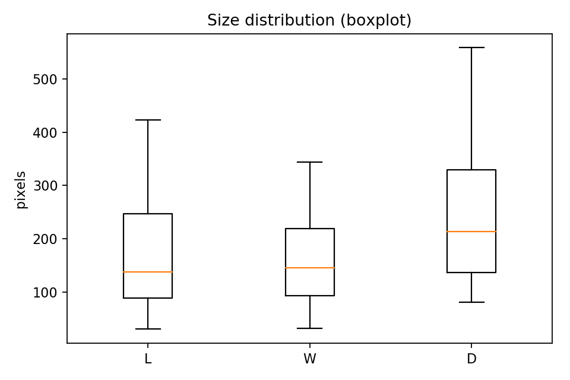

# Wood-Chip Monitor

**An Edge-AI System for Real-Time Wood-Chip Quality Evaluation**

Wood-Chip Monitor is a portable edge-AI platform for real-time wood-chip quality assessment on NVIDIA Jetson hardware. The system integrates computer vision, physical size estimation, size-distribution monitoring, oversize detection, vision-based moisture assessment, and an operator-facing web dashboard in a local edge deployment.

> **Repository status:** Public research-software release in preparation. The repository currently preserves the core deployed application, model architecture, deployment utilities, examples, and system documentation while reproducibility materials are being finalized.

<p align="center">
  
</p>

---

## Overview

Conventional wood-chip quality assessment often relies on periodic manual sampling and offline measurements. Wood-Chip Monitor was developed to move visual quality assessment closer to the production environment by combining computer vision, edge computing, physical measurement, and operator-facing decision support in a portable monitoring platform.

The system is designed to provide:

- real-time wood-chip detection,
- physical chip-size estimation,
- rolling size-distribution analysis,
- oversize-chip identification,
- configurable quality thresholds,
- image-based moisture assessment,
- TensorRT-accelerated edge inference,
- local event and audit records,
- device-status monitoring,
- and a browser-based operator dashboard.

The primary inspection workflow is designed to operate locally on the edge device without requiring cloud inference.

---

## Key Capabilities

### Real-Time Wood-Chip Detection

A TensorRT-optimized DETR-based detector identifies individual wood chips in the camera stream.

Detector outputs support:

- dense chip localization,
- downstream geometric measurement,
- live visualization,
- oversize assessment,
- and chip-region extraction for moisture inference.

### Physical Size Estimation

Detected bounding boxes are converted from image-space measurements to physical chip dimensions using scene calibration.

These measurements are aggregated to characterize the observed chip population rather than treating each detection independently.

### Size-Distribution Monitoring

The system continuously maintains chip-size statistics and distribution information that can be visualized through the monitoring interface.

### Oversize Detection

Physical chip measurements are evaluated against configurable quality thresholds.

Oversize material can be highlighted visually and summarized through quality-control metrics.

### Moisture Assessment

Wood-Chip Monitor integrates **MoistNetLite**, a lightweight vision model for image-based moisture classification.

Selected high-confidence chip regions are processed using a configurable Top-K strategy to limit moisture-inference cost in dense scenes.

## Quick Start

Wood-Chip Monitor is intended to run on the configured NVIDIA Jetson deployment platform with the required TensorRT engines available locally.

```bash
# Clone and enter the repository
git clone https://github.com/amirhossein-eskorouchi/Wood-Chip-Monitor.git
cd Wood-Chip-Monitor

# Create a local device configuration
cp configs/device.env.example configs/device.env

# Edit device-specific settings and credentials
nano configs/device.env

# Load configuration
set -a
source configs/device.env
set +a

# Start the monitoring application
python -m app.backend_app
```

Then open:

```text
http://localhost:8000
```

in a browser on the Jetson, or use `http://<JETSON-IP>:8000` from another device on the same network.

> **Note:** TensorRT engines and trained model artifacts are not distributed in this repository. See [`models/README.md`](models/README.md) and [`docs/jetson-setup.md`](docs/jetson-setup.md) for model and deployment requirements.

### Edge Deployment

The reference system executes the primary AI pipeline locally using NVIDIA Jetson hardware and TensorRT-optimized models.

### Operator Dashboard

A local browser interface provides access to:

- live inspection,
- annotated camera imagery,
- size-distribution information,
- oversize status,
- moisture assessment,
- historical events,
- quality-rule configuration,
- audit information,
- and device status.

---

## End-to-End Workflow

The deployed monitoring pipeline combines image acquisition, accelerated AI inference, quality analytics, backend services, and browser-based visualization.

~~~text
RGB Camera
    |
    v
Frame Acquisition
    |
    v
Image Preprocessing
    |
    v
DETR TensorRT Inference
    |
    +---------------------------+
    |                           |
    v                           v
Chip Localization          Chip ROI Selection
    |                           |
    v                           v
Physical Size              MoistNetLite
Estimation                 TensorRT Inference
    |                           |
    v                           v
Rolling Size               Moisture
Statistics                 Assessment
    |                           |
    +------------+--------------+
                 |
                 v
           Quality Metrics
                 |
       +---------+---------+
       |         |         |
       v         v         v
Distribution  Oversize   System
  Analysis     Rules     Health
       |         |         |
       +---------+---------+
                 |
                 v
          FastAPI Backend
                 |
       +---------+---------+
       |         |         |
       v         v         v
     Events    Audit     Device
               Logs      Status
       |         |         |
       +---------+---------+
                 |
                 v
         Browser Dashboard
~~~

A detailed description of the software and data-flow architecture is available in:

**[`docs/architecture.md`](docs/architecture.md)**

---
## Hardware Prototype

<p align="center">
  
</p>

The reference prototype integrates the edge-computing platform, camera, local display, and custom enclosure required for portable wood-chip monitoring.

The original deployed platform used an NVIDIA Jetson Nano.

Reference environment information is documented in:

**[`docs/jetson-setup.md`](docs/jetson-setup.md)**

Additional information about the integrated edge-computing platform and mechanical prototype is available in:

**[`hardware/README.md`](hardware/README.md)**

---

## AI Components

Wood-Chip Monitor integrates two primary computer-vision components.

### Wood-Chip Detector

The detector provides the object localizations used for:

- physical chip measurement,
- rolling size statistics,
- oversize analysis,
- visualization,
- and moisture-model crop selection.

The default deployment artifact is expected to be:

```text
models/detr_resnet101_fp16.engine
```

The complete research implementation and experimental framework associated with the detector are maintained separately in the **UOT-DETR** repository:

https://github.com/amirhossein-eskorouchi/UOT-DETR

### MoistNetLite

MoistNetLite provides image-based moisture assessment for selected detected chip regions.

The source architecture is included in:

```text
models/moistnetlite.py
```

The reference deployment expects:

```text
models/moistnetlite_fp16.engine
models/moistnetlite_classes.txt
```

Detailed model information is available in:

**[`models/README.md`](models/README.md)**

---

## Moisture-Inference Strategy

Dense wood-chip scenes may contain many simultaneous detections.

Rather than running the moisture model on every detected object, the live pipeline supports a configurable Top-K selection strategy:

~~~text
DETR Detections
       |
       v
Confidence Filtering
       |
       v
Candidate Chip Regions
       |
       v
Top-K Selection
       |
       v
Crop Extraction
       |
       v
MoistNetLite Inference
       |
       v
Moisture Assessment
~~~

This strategy bounds the number of moisture-model evaluations performed during an inference cycle while allowing representative high-confidence chip regions to contribute to the frame-level moisture estimate.

---
## Dashboard

The browser-based dashboard communicates with the local FastAPI backend and provides an operator-facing view of the monitoring process.

The interface supports functions including:

- live annotated inspection,
- chip-size visualization,
- size-distribution summaries,
- oversize monitoring,
- moisture information,
- system status,
- quality-rule configuration,
- event history,
- audit records,
- and device information.

The frontend implementation is maintained in:

```text
app/web/index.html
```

The backend service is maintained in:

```text
app/backend_app.py
```

## User Documentation

Operator-facing functionality, role-based access, monitoring controls, events, quality rules, audit logs, and device-health features are documented in:

**[`docs/user-guide.md`](docs/user-guide.md)**

---

## Quality Analytics

The deployed system converts object detections into population-level quality information.

### Example Size Distribution

<p align="center">
  
</p>

### Example Size Statistics

<p align="center">
  
</p>

These visualizations illustrate the type of statistical information generated from detected and physically measured chips.

---

## Software Architecture

The deployed application is organized around three primary runtime components:

~~~text
app/
|-- live_cam_trt.py
|-- backend_app.py
|-- __init__.py
`-- web/
    `-- index.html
~~~

### `app/live_cam_trt.py`

The edge-inference runtime is responsible for:

- camera acquisition,
- image preprocessing,
- TensorRT detector execution,
- detection filtering,
- geometric chip measurement,
- pixel-to-millimeter calibration,
- rolling size statistics,
- size-distribution generation,
- oversize evaluation,
- MoistNetLite TensorRT execution,
- annotated visualization,
- and maintenance of the latest shared inference state.

### `app/backend_app.py`

The FastAPI backend provides the local device-service layer, including:

- application startup and shutdown,
- access to the latest inference state,
- annotated-image streaming,
- runtime configuration,
- authentication,
- role-based access control,
- event persistence,
- audit logging,
- quality-rule management,
- and device-health reporting.

### `app/web/index.html`

The browser interface provides the operator-facing monitoring environment, including:

- live inspection imagery,
- chip-size statistics,
- distribution visualization,
- oversize status,
- moisture assessment,
- events,
- quality rules,
- audit information,
- device status,
- and authorized runtime controls.

The complete system architecture is documented in:

**[`docs/architecture.md`](docs/architecture.md)**

---
## Edge Deployment

The reference prototype was deployed on an NVIDIA Jetson Nano using TensorRT-accelerated inference.

The documented deployment environment included:

```text
Hardware:          NVIDIA Jetson Nano
GPU:               NVIDIA Tegra X1
Operating system:  Ubuntu 18.04.5 LTS
Python:            3.6.9
NVIDIA L4T:        R32.6.1
System memory:     approximately 4 GB
```

This environment represents the original validated prototype and should not be interpreted as a recommendation to use an outdated software stack for new deployments.

Deployment documentation is available in:

- [`docs/architecture.md`](docs/architecture.md)
- [`docs/jetson-setup.md`](docs/jetson-setup.md)
- [`docs/software-environment.md`](docs/software-environment.md)
- [`models/README.md`](models/README.md)
- [`configs/device.env.example`](configs/device.env.example)

---

## Configuration

Machine-specific deployment paths have been moved out of the source code where practical and can be supplied through environment variables.

An example configuration is provided in:

```text
configs/device.env.example
```

Supported configuration includes:

### Camera

```text
WOODCHIP_CAMERA_DEVICE
WOODCHIP_CAMERA_WIDTH
WOODCHIP_CAMERA_HEIGHT
WOODCHIP_CAMERA_FPS
```

### Model Artifacts

```text
WOODCHIP_MODEL_DIR
WOODCHIP_DETR_ENGINE
WOODCHIP_MOISTURE_ENGINE
WOODCHIP_MOISTURE_CLASSES
```

### Runtime Storage

```text
WOODCHIP_DB_PATH
WOODCHIP_OUTPUT_DIR
```

### Device Identity

```text
WOODCHIP_DEVICE_ID
```

Deployment-specific credentials should never be committed to the repository.

---

## Model Artifacts

The private research repository preserves both source-level model definitions and archived model-development artifacts.

### Model Architecture

The MoistNetLite source definition is tracked directly in Git:

~~~text
models/
|-- moistnetlite.py
`-- README.md
~~~

### Archived Development Artifacts

The following model artifacts are preserved under `models/artifacts/`:

~~~text
models/artifacts/
|-- best-detr.ckpt
|-- detr_resnet101.onnx
|-- detr_resnet101_simplified.onnx
|-- moistnetlite_best_weights.h5
|-- moistnetlite_classes.txt
|-- moistnetlite_dynamic.onnx
`-- moistnetlite_dynamic_simplified.onnx
~~~

Large binary model artifacts are tracked using Git LFS because several files exceed the practical size limits of ordinary Git storage.

The archived files represent different stages of detector and moisture-model development and conversion.

### Detector Artifact Flow

~~~text
DETR Training / Checkpoint
          |
          v
     best-detr.ckpt
          |
          v
   detr_resnet101.onnx
          |
          v
detr_resnet101_simplified.onnx
          |
          v
TensorRT Engine Generation
          |
          v
Jetson Runtime
~~~

### Moisture Artifact Flow

~~~text
MoistNetLite Development
          |
          v
moistnetlite_best_weights.h5
          |
          v
moistnetlite_dynamic.onnx
          |
          v
moistnetlite_dynamic_simplified.onnx
          |
          v
TensorRT Engine Generation
          |
          v
Jetson Runtime
~~~

### TensorRT Runtime Artifacts

The live application is configured to load TensorRT deployment engines such as:

~~~text
detr_resnet101_fp16.engine
moistnetlite_fp16.engine
~~~

These serialized `.engine` files are hardware- and TensorRT-version-dependent deployment artifacts.

They are not currently part of the archived model-artifact set preserved in this repository.

The moisture class-label file is preserved as:

~~~text
models/artifacts/moistnetlite_classes.txt
~~~

Deployment paths can be configured through the environment variables documented in:

**[`configs/device.env.example`](configs/device.env.example)**

Additional model documentation is available in:

**[`models/README.md`](models/README.md)**

---
## Standalone TensorRT Inference

A standalone inference utility is provided in:

```text
tools/infer_trt.py
```

It can be used to run the deployed detector on a directory of images independently of the full live monitoring application.

Example usage:

```bash
python tools/infer_trt.py \
    --engine models/detr_resnet101_fp16.engine \
    --images /path/to/input/images \
    --output outputs/predictions
```

Additional information is available in:

**[`tools/README.md`](tools/README.md)**

---

## Software Environment

The original Jetson deployment uses a legacy and tightly coupled NVIDIA software stack.

For this reason, the repository does not currently claim that a generic:

```bash
pip install -r requirements.txt
```

command reproduces the validated device environment.

TensorRT, CUDA, PyCUDA, OpenCV, JetPack/L4T, and related components must be handled according to the target NVIDIA platform.

The current software-environment policy and dependency boundaries are documented in:

**[`docs/software-environment.md`](docs/software-environment.md)**

Exact dependency versions will only be published when they have been verified against the original deployment environment or successfully reproduced on an equivalent system.

---

## Validation

The deployment pipeline was developed through staged validation from reference workstation processing to manual preprocessing/post-processing reconstruction, Jetson TensorRT inference, and integrated size analytics.

A compact record of these development stages is preserved in:

**[`validation/README.md`](validation/README.md)**

Representative historical outputs are included for transparency and provenance without committing the large intermediate tensors and duplicated development artifacts from the original archive.
---

## Repository Structure

The following tree is an abridged view of the main research-software components:

~~~text
Wood-Chip-Monitor/
|-- app/
|   |-- backend_app.py
|   |-- live_cam_trt.py
|   |-- __init__.py
|   `-- web/
|       `-- index.html
|
|-- assets/
|   |-- dashboard.png
|   |-- prototype.png
|   |-- size_boxplot.png
|   `-- size_distribution.png
|
|-- configs/
|   `-- device.env.example
|
|-- docs/
|   |-- architecture.md
|   |-- jetson-setup.md
|   |-- related-research.md
|   |-- software-environment.md
|   `-- user-guide.md
|
|-- hardware/
|   |-- README.md
|   `-- cad/
|       |-- README.md
|       |-- NEW ASSEMBLY.SLDASM
|       `-- SolidWorks part files
|
|-- models/
|   |-- artifacts/
|   |   |-- best-detr.ckpt
|   |   |-- detr_resnet101.onnx
|   |   |-- detr_resnet101_simplified.onnx
|   |   |-- moistnetlite_best_weights.h5
|   |   |-- moistnetlite_classes.txt
|   |   |-- moistnetlite_dynamic.onnx
|   |   `-- moistnetlite_dynamic_simplified.onnx
|   |-- moistnetlite.py
|   `-- README.md
|
|-- tools/
|   |-- infer_trt.py
|   `-- README.md
|
|-- validation/
|   |-- jetson_tensorrt.csv
|   |-- manual_processing.csv
|   |-- reference_processing.csv
|   |-- size_statistics.csv
|   `-- README.md
|
|-- .gitattributes
|-- .gitignore
|-- ACKNOWLEDGMENTS.md
|-- CITATION.cff
`-- README.md
~~~

---
## Documentation

Current technical documentation includes:

| Document | Purpose |
|---|---|
| [`docs/architecture.md`](docs/architecture.md) | End-to-end system and software architecture |
| [`docs/jetson-setup.md`](docs/jetson-setup.md) | Reference Jetson deployment environment |
| [`docs/software-environment.md`](docs/software-environment.md) | Dependency boundaries and reproducibility guidance |
| [`models/README.md`](models/README.md) | AI-model components and deployment artifacts |
| [`tools/README.md`](tools/README.md) | Standalone deployment utilities |
| [`configs/device.env.example`](configs/device.env.example) | Example device-level configuration |

---

**Public-release documentation:**
[`docs/RELEASE.md`](docs/RELEASE.md)

---

## Related Research

Wood-Chip Monitor is part of a broader research effort on vision-based wood-chip quality assessment.

| Resource | Role in the Research Program |
|---|---|
| **UOT-DETR** | Distribution-aware dense object detection and wood-chip size-distribution estimation |
| **MoistNet / MoistNetLite** | Vision-based wood-chip moisture assessment |
| **WoodChip-Detection** | Public dataset for dense wood-chip detection and instance analysis |
| **Edge-AI System Paper** | Integrated deployment of geometry and moisture assessment on embedded hardware |

Detailed publication and resource information is available in:

**[`docs/related-research.md`](docs/related-research.md)**

### UOT-DETR

The UOT-DETR project focuses on the underlying object-detection and distribution-aware visual measurement methodology.

It contains the research implementation, benchmarks, experimental comparisons, ablation studies, and reproducibility resources associated with the detection framework.

**Repository:**
https://github.com/amirhossein-eskorouchi/UOT-DETR

### MoistNet / MoistNetLite

MoistNetLite provides the lightweight moisture-assessment component integrated into the edge system.

The public Wood-Chip Monitor repository includes the lightweight model architecture and deployment integration.

Additional publication and research-resource links will be added as the repository release is finalized.

### Wood-Chip Detection Dataset

The underlying research effort also includes annotated wood-chip imagery used for model development and evaluation.

The corresponding dataset and publication links will be added to the final research-resource section.

---

## Research Code vs. Deployment Code

The project ecosystem intentionally separates methodological research from deployed application software.

### UOT-DETR

Focuses on:

- model development,
- distribution-aware learning,
- detector training,
- experimental benchmarking,
- ablation studies,
- sensitivity analysis,
- scientific reproducibility.

### Wood-Chip Monitor

Focuses on:

- camera integration,
- TensorRT inference,
- physical chip measurement,
- size-distribution monitoring,
- oversize detection,
- moisture-model integration,
- backend services,
- operator interaction,
- system governance,
- and Jetson deployment.

This separation keeps both repositories focused while preserving the connection between methodological research and real-world technology implementation.

---

## Data and Runtime Privacy

Local application databases, runtime output, credentials, and machine-specific configuration should not be committed to Git.

The repository excludes items such as:

```text
data/
outputs/
*.db
*.sqlite
*.sqlite3
.env
```

Users deploying the application should store credentials and local operational information outside version control.

---

## Project Status

Wood-Chip Monitor version 0.1.0 is the initial public research-software and
engineering release.

The repository includes:

- the Jetson inference pipeline;
- FastAPI backend and browser dashboard;
- configurable model and runtime paths;
- MoistNetLite architecture;
- standalone TensorRT inference;
- Git LFS-managed model artifacts;
- SolidWorks CAD source;
- example images and predictions;
- architecture and deployment documentation;
- operator guidance;
- validation records;
- citation metadata; and
- public-release licensing and attribution boundaries.

The project remains research software. Device calibration, environment
reconstruction, hardware validation, and deployment security remain the
responsibility of each user.

---

## Citation

If you use this repository, cite:

Amirhossein Eskorouchi, *Wood-Chip Monitor*, version 0.1.0, 2026.
<https://github.com/amirhossein-eskorouchi/Wood-Chip-Monitor>

Associated system publication:

Amirhossein Eskorouchi, Prashant Bhattarai, Abdur Rahman,
Mohammad Marufuzzaman, Jason T. Street, and Haifeng Wang,
"An Edge Artificial Intelligence System for Wood Chip Quality Evaluation,"
*Proceedings of the IISE Annual Conference & Expo 2026*, 2026.

Citation resources:

- [`CITATION.cff`](CITATION.cff)
- [`CITATION.bib`](CITATION.bib)
- [`docs/CITATION.md`](docs/CITATION.md)
- [`docs/related-research.md`](docs/related-research.md)

---

## License

Independently authored software and documentation are available under the
[MIT License](LICENSE).

See [`NOTICE`](NOTICE) for trained models, CAD files, datasets, publications,
example media, third-party frameworks, and hardware-component boundaries.

---

## Security

See [`SECURITY.md`](SECURITY.md). Never commit concrete credentials, local
databases, production output, or private deployment configuration.

---

## Contributing

See [`CONTRIBUTING.md`](CONTRIBUTING.md) and
[`CODE_OF_CONDUCT.md`](CODE_OF_CONDUCT.md).

---

## Acknowledgments

Wood-Chip Monitor was developed through contributions spanning computer
vision, edge-AI deployment, quality analytics, moisture assessment, software
integration, and physical prototype development.

See [`ACKNOWLEDGMENTS.md`](ACKNOWLEDGMENTS.md).
